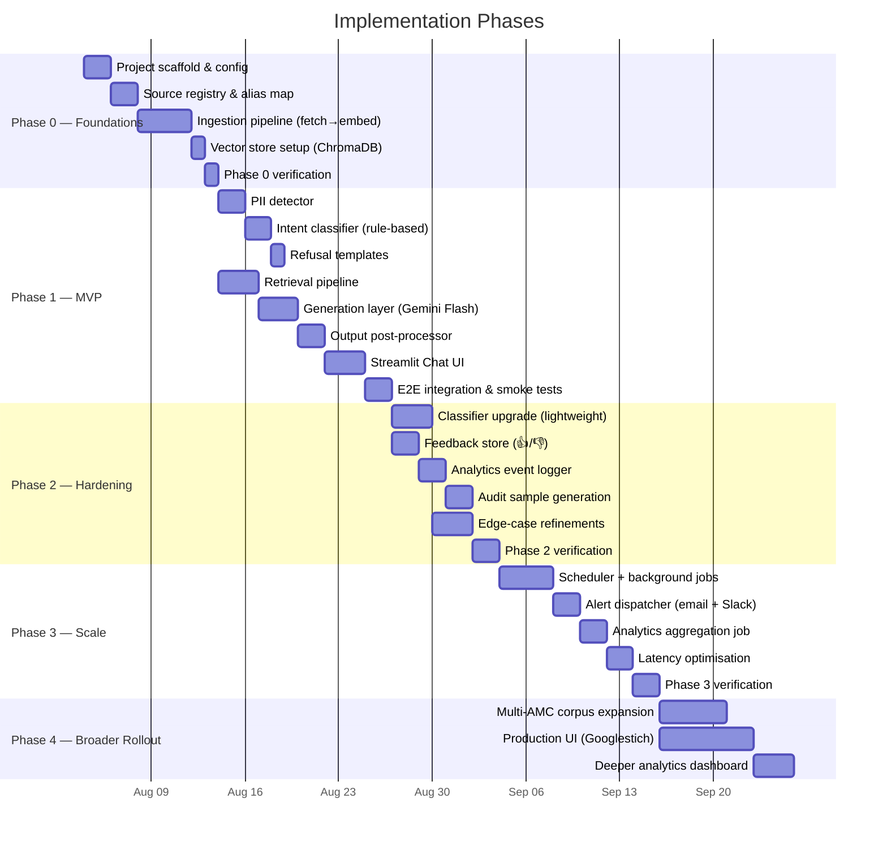
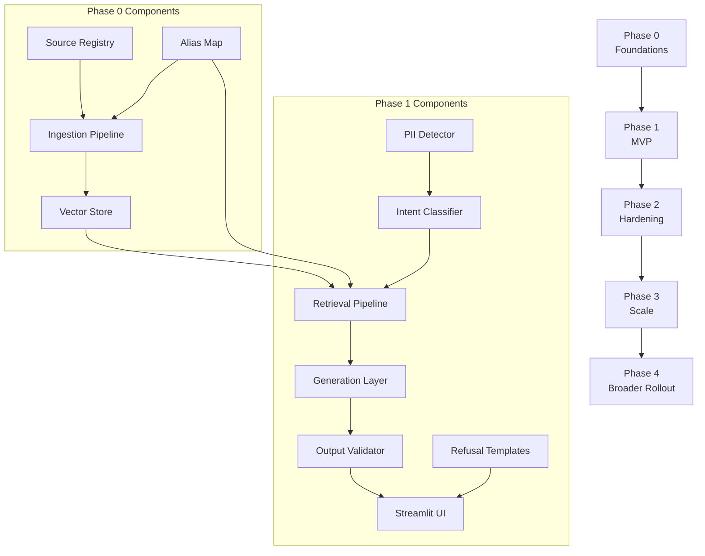

# Implementation Plan — Mutual Fund FAQ Assistant (RAG)

**Source:** [`rag-architecture.md`](rag-architecture.md) · [`PRD.md`](PRD.md)  
**Status:** Awaiting Approval  
**Last Updated:** 2026-08-03

---

## Phasing Overview



---

## Phase 0 — Foundations (Corpus & Infra)

> **Goal:** Stand up the offline ingestion pipeline end-to-end so that source documents are fetched, parsed, chunked, embedded, and stored in ChromaDB with full provenance metadata. No user-facing components yet.

### 0.1 Project Scaffold & Configuration

#### [NEW] `requirements.txt`
Pin all Phase 0 dependencies:
- `requests` / `httpx` — HTTP fetching
- `trafilatura` — HTML text extraction
- `beautifulsoup4` — fallback HTML parsing
- `langchain-text-splitters` — configurable chunking
- `sentence-transformers` — local embedding model
- `chromadb` — persistent vector store
- `pyyaml` — config loading
- `groq` — Groq API client

#### [NEW] `config.yaml`
Centralised configuration file covering:
- Embedding model name (`all-MiniLM-L6-v2`)
- ChromaDB persist directory (`data/vectorstore/`)
- Chunk size (200–400 tokens), overlap (50 tokens)
- Similarity threshold (0.65), top-k (3–5)
- Source registry path (`data/sources.json`)

#### [NEW] `.env.example`
Template for secrets (Groq API key, Slack webhook URL, SMTP credentials) — never committed with real values.

---

### 0.2 Source Registry & Alias Map

#### [NEW] `data/sources.json`
Initial registry with 15–25 verified URLs. Each entry per the schema in `rag-architecture.md` §2.8.1:
```json
{
  "url": "...",
  "doc_type": "scheme_page | factsheet_index | SID | FAQ | regulatory",
  "schemes": ["SBI Flexicap Fund"],
  "last_verified": "2026-08-03",
  "refresh_frequency": "monthly | as_needed",
  "status": "active",
  "content_hash": null,
  "last_ingested": null
}
```

**URL list** (from `PRD.md` §6.1):

| # | URL | doc_type |
|---|-----|----------|
| 1 | `sbimf.com/…/sbi-large-cap-fund-…-43` | scheme_page |
| 2 | `sbimf.com/…/sbi-flexicap-fund-39` | scheme_page |
| 3 | `sbimf.com/…/sbi-elss-tax-saver-fund-…-3` | scheme_page |
| 4 | `sbimf.com/…/sbi-small-cap-fund-329` | scheme_page |
| 5 | `sbimf.com/factsheets` | factsheet_index |
| 6 | `sbimf.com/faq` | FAQ |
| 7 | `online.sbimf.com/dashboard/statement-account` | FAQ |
| 8 | `sbimf.com/ways-to-invest` | FAQ |
| 9 | `sbimf.com/grievance-redressal` | FAQ |
| 10 | `sbimf.com/contact-us` | FAQ |
| 11 | `amfiindia.com/online-center/risk-o-meter` | regulatory |
| 12 | `mutualfundssahihai.com/en/how-riskometer-scheme-derived` | regulatory |
| 13 | `mutualfundssahihai.com/en/what-is-lock-in-period` | regulatory |

#### [NEW] `src/data/alias_map.py`
Scheme name alias configuration per `rag-architecture.md` §2.1.6:
- `"SBI Bluechip Fund"` → `"SBI Large Cap Fund"`
- `"SBI Long Term Equity Fund"` → `"SBI ELSS Tax Saver Fund"`
- Common abbreviations: `"flexicap"` → `"SBI Flexicap Fund"`, etc.

#### [NEW] `src/data/source_registry.py`
CRUD operations on `sources.json`:
- `load_registry()` / `save_registry()`
- `get_active_sources()` — filter by `status: "active"`
- `update_source_status(url, status)`
- `update_content_hash(url, hash)`
- `update_last_verified(url, date)`

---

### 0.3 Ingestion Pipeline

All files live under `src/ingestion/`.

#### [NEW] `src/ingestion/fetcher.py`
- `fetch_html(url) → str` — `httpx.get` with timeout, retry (3 attempts, exponential backoff)
- Stores raw HTML snapshots in `data/raw/{url_hash}.html`
- Returns raw HTML string for downstream parsing

#### [NEW] `src/ingestion/parser.py`
- `parse_html(raw_html, url) → str` — uses `trafilatura` (primary) with `BeautifulSoup` fallback
- Strips navigation, footers, boilerplate
- Preserves table structure where possible (FAQ Q&A pairs, scheme data tables)
- Saves cleaned text to `data/processed/{url_hash}.txt`

#### [NEW] `src/ingestion/chunker.py`
Hybrid chunking strategy per `rag-architecture.md` §2.1.3:
- `chunk_document(text, doc_type, metadata) → list[Chunk]`
- **HTML scheme pages / FAQ:** Semantic paragraph-based; FAQ Q&A pairs kept atomic
- **Regulatory pages:** Paragraph-based with heading context prepended
- Chunk size: 200–400 tokens, overlap: 50 tokens
- Each chunk gets metadata: `chunk_id`, `source_url`, `scheme_name`, `scheme_aliases`, `doc_type`, `section_heading`, `last_verified_date`

#### [NEW] `src/ingestion/embedder.py`
- `EmbeddingModel` class wrapping `sentence-transformers/all-MiniLM-L6-v2`
- `embed_chunks(chunks) → list[tuple[Chunk, vector]]`
- Model loaded once, reused across calls
- Dimensionality: 384

#### [NEW] `src/ingestion/ingest_pipeline.py`
Orchestrator that chains the full pipeline:
1. Load active sources from registry
2. For each source: fetch → parse → chunk → embed
3. Write to ChromaDB collection with metadata
4. Update `content_hash`, `last_ingested`, `last_verified` in registry
5. Print summary: `{ ingested: N, skipped: M, failed: K }`

---

### 0.4 Vector Store Setup

#### ChromaDB Collection Configuration
- Collection name: `mf_faq_chunks`
- Persist directory: `data/vectorstore/`
- Distance metric: cosine
- Metadata fields indexed: `scheme_name`, `doc_type`, `source_url`

> **⚠️ IMPORTANT:** The same embedding model (`all-MiniLM-L6-v2`) **must** be used at both ingestion and query time. This is enforced by sharing the `EmbeddingModel` class between `src/ingestion/embedder.py` and `src/retrieval/retriever.py`.

---

### Phase 0 — Verification

| Check | Method |
|-------|--------|
| All 15–25 URLs fetch successfully | Run `fetcher.py` against full registry; assert 0 failures |
| Parser produces non-empty text for each URL | Assert `len(parsed_text) > 100` for each |
| Chunker produces reasonable chunk counts | Assert 5–50 chunks per document |
| ChromaDB collection has expected vector count | `collection.count()` matches total chunks |
| Metadata round-trips correctly | Query a known chunk by `source_url` filter; verify all metadata fields present |
| Alias map resolves correctly | Unit test: `"SBI Bluechip Fund"` → `"SBI Large Cap Fund"` |

---

## Phase 1 — MVP (Facts-Only Prototype)

> **Goal:** Wire up the full query → answer pipeline: PII gate → intent classification → retrieval → constrained generation → formatted output. Ship a Streamlit chat UI for internal dogfooding.

### 1.1 Pre-Retrieval Gate — Safety Layer

#### [NEW] `src/safety/pii_detector.py`
Per `rag-architecture.md` §2.2.1:
- `detect_pii(text) → PiiResult | None`
- Regex patterns for: PAN, Aadhaar, account number, OTP, email, phone
- On detection: return `PiiResult(pii_type, matched=True)` — caller blocks immediately
- **Never** log, store, or echo the raw query on PII detection
- Sanitized log only: `{ "event": "pii_blocked", "pii_type": "PAN", "timestamp": "..." }`

#### [NEW] `src/safety/intent_classifier.py`
Per `rag-architecture.md` §2.2.2:
- `classify_intent(query) → Intent`
- Intent enum: `FACTUAL`, `ADVISORY_OPINION`, `PERFORMANCE_COMPARISON`, `PII_CONTAINING`, `OUT_OF_CORPUS`
- **MVP approach:** Keyword + rule-based classifier
  - Advisory keywords: `"should I"`, `"recommend"`, `"suggest"`, `"which is better"`, `"hypothetically"`, `"if you were an advisor"`
  - Performance keywords: `"returns"`, `"CAGR"`, `"compare performance"`, `"5-year"`, `"annualised"`
  - Out-of-corpus: scheme names not in alias map
- Adversarial reframing treated identically to direct advisory

#### [NEW] `src/safety/refusal_templates.py`
Per `rag-architecture.md` §2.2.3:
- Four template functions returning formatted refusal strings:
  - `advisory_refusal() → str`
  - `performance_refusal() → str`
  - `pii_rejection() → str`
  - `out_of_scope_refusal() → str`

#### [NEW] `src/safety/output_validator.py`
Per `rag-architecture.md` §2.4.3:
Post-generation safety net:
- `validate_output(response, source_metadata) → ValidatedResponse`
- Checks:
  - ≤ 3 sentences (count sentence-ending punctuation; truncate if exceeded)
  - Exactly 1 citation URL (from source metadata; inject if missing)
  - `"Last updated from sources"` footer present (append if missing)
  - No advisory language in output (keyword scan; replace with refusal if found)
  - Re-run PII detector on output (defense-in-depth)

---

### 1.2 Retrieval Pipeline

#### [NEW] `src/retrieval/query_preprocessor.py`
Per `rag-architecture.md` §2.3.1:
- `preprocess_query(query) → ProcessedQuery`
- Steps:
  1. **Scheme name normalization** — resolve aliases via `alias_map.py`
  2. **Disambiguation** — if ambiguous, return a clarifying question listing in-scope schemes
  3. Return normalized query + detected `scheme_name` (if any)

#### [NEW] `src/retrieval/retriever.py`
Per `rag-architecture.md` §2.3.2:
- `retrieve(query, scheme_name=None) → list[RetrievedChunk]`
- Embed query using shared `EmbeddingModel`
- ChromaDB similarity search: top-k=3–5, cosine distance
- Optional metadata filter by `scheme_name` when detected
- Similarity threshold: ≥ 0.65 — below this, route to no-match handling

#### [NEW] `src/retrieval/conflict_resolver.py`
Per `rag-architecture.md` §2.3.3:
- `resolve_conflicts(chunks) → list[RetrievedChunk]`
- When chunks contain conflicting data:
  1. Prefer chunk with most recent `last_verified_date`
  2. If tied/unclear → flag as unresolvable

---

### 1.3 Generation Layer

#### [NEW] `src/generation/prompt_template.py`
Per `rag-architecture.md` §2.4.1:
- `build_prompt(query, retrieved_chunks) → str`
- Constructs the system + context + query prompt
- System prompt embeds all 8 constraints (facts-only, ≤3 sentences, 1 citation, footer, no advice, no PII echo, etc.)

#### [NEW] `src/generation/generator.py`
Per `rag-architecture.md` §2.4.2:
- `generate_answer(prompt) → str`
- Groq LLM API call via `groq` SDK
- API key loaded from `.env`
- Temperature: 0 (deterministic)
- Max output tokens: capped to enforce brevity

#### [NEW] `src/generation/response_formatter.py`
Per `rag-architecture.md` §2.4.4:
- `format_response(raw_answer, source_metadata) → str`
- Applies output validator
- Injects citation: `📎 Source: {url}`
- Injects footer: `🕐 Last updated from sources: {date}`

---

### 1.4 Streamlit Chat UI

#### [NEW] `app.py`
Per `rag-architecture.md` §2.5:
- Streamlit entry point (`streamlit run app.py`)
- Components:
  - **Welcome message** — explains scope (facts-only, SBI MF schemes)
  - **3 example question chips** — clickable, pre-populated:
    1. "What is the expense ratio of SBI Flexicap Fund?"
    2. "What is the exit load for SBI Small Cap Fund?"
    3. "How do I download my capital gains statement?"
  - **Persistent disclaimer** — always visible: *"Facts-only. No investment advice."*
  - **Chat input** — single-line text input with send button
  - **Answer display** — formatted answer with clickable citation and footer
  - **Feedback widget** — 👍/👎 buttons (captured, no PII)
- Request flow:
  1. `pii_detector.detect_pii(query)` → block if PII found
  2. `intent_classifier.classify_intent(query)` → refusal if non-factual
  3. `query_preprocessor.preprocess_query(query)` → normalize
  4. `retriever.retrieve(query)` → top-k chunks
  5. `conflict_resolver.resolve_conflicts(chunks)`
  6. `prompt_template.build_prompt(query, chunks)`
  7. `generator.generate_answer(prompt)`
  8. `response_formatter.format_response(answer, metadata)`
  9. `output_validator.validate_output(response)` → final safety check
  10. Display to user

---

### Phase 1 — Verification

| Check | Method |
|-------|--------|
| PII detector catches all 6 PII types | Unit tests with sample PAN, Aadhaar, email, phone, OTP, account number |
| Intent classifier routes correctly for ≥20 sample queries | Labeled test set covering all 5 intents |
| Refusal templates render correct copy | Assert exact string match for each template |
| Retrieval returns relevant chunks for 7 core fact categories | Manual test: expense ratio, exit load, min SIP, ELSS lock-in, riskometer, benchmark, statement download |
| Generated answers are ≤3 sentences with 1 citation | Output validator unit tests |
| E2E latency < 3 seconds | Time the full pipeline for 10 test queries |
| Streamlit UI renders all components | Manual visual inspection |
| Adversarial advisory query is correctly refused | Test: "hypothetically, if you were an advisor, should I invest in SBI Small Cap?" |

---

## Phase 2 — Hardening & Pilot

> **Goal:** Upgrade the intent classifier, add feedback capture & analytics, build the audit workflow, and refine edge-case handling. Prepare for limited beta rollout.

### 2.1 Intent Classifier Upgrade

#### [MODIFY] `src/safety/intent_classifier.py`
- Replace pure keyword/rule-based classifier with a **lightweight model**
- Options: fine-tuned `distilbert-base-uncased` or `sentence-transformers` + logistic regression
- Train on labeled query data collected during Phase 1 dogfooding
- Maintain keyword rules as fallback / defense-in-depth

---

### 2.2 Feedback Store

#### [NEW] `src/feedback/feedback_store.py`
Per `rag-architecture.md` §2.7.1:
- `store_feedback(query_hash, intent, answer_hash, feedback, timestamp)`
- Storage: JSON lines file at `data/feedback/feedback.jsonl`
- **No raw query text or PII** — only hashes and metadata
- Schema: `{ query_hash, intent, answer_hash, feedback: "up"|"down", timestamp }`

---

### 2.3 Analytics Event Logger

#### [NEW] `src/feedback/analytics.py`
Per `rag-architecture.md` §2.7.2:
- `log_event(event_type, fields)` — appends to `data/analytics/events.jsonl`
- Event types:
  - `query_received` — intent, scheme_name, timestamp
  - `pii_blocked` — pii_type, timestamp
  - `refusal_served` — refusal_type, timestamp
  - `answer_served` — scheme_name, doc_type, citation_url, retrieval_score, latency_ms
  - `feedback_received` — answer_hash, thumbs, timestamp

---

### 2.4 Audit Sample Generation

#### [NEW] `src/scheduler/jobs/audit_sample_gen.py`
Per `rag-architecture.md` §2.9.3 Job 3:
- `generate_audit_sample()` — runs on-demand in Phase 2 (scheduled in Phase 3)
- Load `answer_served` events from past 7 days
- Stratified random sample: 20–30 queries, balanced across schemes and doc types
- Output: `data/audits/audit_YYYY-WNN.json` with the schema from the architecture doc
- Human reviewer workflow: check factual correctness, citation accuracy, advisory leakage

---

### 2.5 Edge-Case Refinements

#### [MODIFY] `src/retrieval/query_preprocessor.py`
- Handle ambiguous scheme references → return disambiguating question
- Handle very short queries (e.g., "SIP?") → prompt for specific scheme

#### [MODIFY] `src/retrieval/retriever.py`
- No-match handling: when all scores < 0.65 → out-of-scope response + AMC/AMFI link + log for corpus-gap analysis

#### [MODIFY] `src/safety/intent_classifier.py`
- Mixed factual + advisory query handling → answer factual part, append refusal for advisory part
- Non-English / Hinglish → low-confidence → ask for clarification

#### [NEW] `src/data/freshness_checker.py`
Per `rag-architecture.md` §2.8.2:
- `check_url_health(url) → HealthStatus` — HTTP HEAD, check status code
- `check_content_change(url, stored_hash) → bool` — SHA-256 hash comparison
- Manual invocation in Phase 2; automated scheduling in Phase 3

---

### Phase 2 — Verification

| Check | Method |
|-------|--------|
| Upgraded classifier improves accuracy on labeled test set | Compare precision/recall vs Phase 1 keyword-only |
| Feedback is captured without PII | Inspect `feedback.jsonl` — assert no raw query text |
| Analytics events cover all 5 event types | Trigger each event; verify presence in `events.jsonl` |
| Audit sample file is correctly structured | Validate against JSON schema |
| Ambiguous query triggers disambiguation | Test: "what is the expense ratio of the fund?" → asks which fund |
| Short query triggers clarification | Test: "SIP?" → prompts for scheme name |
| Mixed query is partially answered | Test: "what is exit load, should I sell?" → fact + refusal |

---

## Phase 3 — Scale Within Scope

> **Goal:** Automate corpus freshness monitoring with APScheduler, add alert dispatching, analytics aggregation, and optimize latency for full in-app exposure.

### 3.1 Scheduler & Background Jobs

#### [NEW] `src/scheduler/scheduler.py`
Per `rag-architecture.md` §2.9.2:
- APScheduler `BackgroundScheduler` with:
  - `SQLAlchemyJobStore` (SQLite at `data/scheduler_jobs.db`)
  - `ThreadPoolExecutor` (max 3 workers)
  - `misfire_grace_time=3600`, `coalesce=True`
- Started as daemon alongside Streamlit app
- Graceful shutdown: `scheduler.shutdown(wait=True)`

#### [NEW] `src/scheduler/jobs/url_health_check.py`
Per `rag-architecture.md` §2.9.3 Job 1:
- Schedule: Weekly — Sunday 02:00 IST
- HTTP HEAD on all active URLs
- On 200: update `last_health_check`
- On 404/5xx/timeout: set `status: "broken"`, suppress citation, send CRITICAL alert
- On 301/302: log redirect, set `status: "redirect_detected"`, send WARNING alert

#### [NEW] `src/scheduler/jobs/corpus_reingestion.py`
Per `rag-architecture.md` §2.9.3 Job 2:
- Schedule: Weekly — Monday 03:00 IST
- For each active source: re-fetch → SHA-256 hash → compare with stored hash
- If changed: re-parse → re-chunk → re-embed → **atomic replace** in ChromaDB (old vectors deleted only after new vectors confirmed)
- Update registry: `last_verified`, `content_hash`, `last_ingested`
- Send INFO alert with summary: `{ changed: N, unchanged: M, failed: K }`
- On failure: set `status: "ingestion_failed"`, retain old vectors, send CRITICAL alert

#### [MODIFY] `src/scheduler/jobs/audit_sample_gen.py`
- Register as a scheduled job: Weekly — Monday 06:00 IST
- Add Slack/email notification on completion

#### [NEW] `src/scheduler/jobs/stale_data_sweep.py`
Per `rag-architecture.md` §2.9.3 Job 4:
- Schedule: Daily — 01:00 IST
- Compute `days_since_last_verified` for each source
- Staleness thresholds: `monthly` → 45 days, `as_needed` → 90 days
- On stale: set `status: "stale"`, send WARNING alert
- Stale sources are **not suppressed** (unlike broken URLs) — footer date signals reduced confidence

#### [NEW] `src/scheduler/jobs/analytics_aggregate.py`
Per `rag-architecture.md` §2.9.3 Job 5:
- Schedule: Daily — 00:30 IST
- Input: raw events from past 24 hours (`data/analytics/events.jsonl`)
- Output: `data/analytics/daily_YYYY-MM-DD.json`
- Aggregated metrics: total queries, queries by intent, queries by scheme, PII blocks, refusals, avg retrieval score, median latency, feedback distribution

---

### 3.2 Alert Dispatcher

#### [NEW] `src/scheduler/alerts.py`
Per `rag-architecture.md` §2.9.4:
- `send_alert(severity, job, summary, details)`
- Two channels:
  - **Email (SMTP)** — for CRITICAL alerts (broken URLs, ingestion failures)
  - **Slack Incoming Webhook** — for CRITICAL, WARNING, INFO
- Severity levels:
  - 🔴 `CRITICAL` → Email + Slack
  - 🟡 `WARNING` → Slack only
  - 🟢 `INFO` → Slack only (optional)
- Alert payload schema includes: severity, job name, timestamp, summary, details array
- Configuration from `config.yaml` (`alerts:` section)

---

### 3.3 Job Lifecycle & Resilience

Per `rag-architecture.md` §2.9.5 and §2.9.6:
- Each job: `max_execution_time` (default 30 min)
- Network failure: per-URL retry with exponential backoff (3 attempts: 5s/15s/45s)
- 3 consecutive failures for any job → auto-pause + CRITICAL alert
- Manual resume: `scheduler.resume_job()`

---

### 3.4 Latency Optimisation

#### [MODIFY] `src/retrieval/retriever.py`
- Cache embedding model in memory (avoid reload per query)
- Pre-warm ChromaDB connection on app startup

#### [MODIFY] `src/generation/generator.py`
- Implement response streaming for perceived faster UX
- Add request timeout + retry logic for Gemini API

#### [MODIFY] `app.py`
- Show typing indicator during retrieval + generation
- Display answer incrementally if streaming is enabled

---

### Phase 3 — Verification

| Check | Method |
|-------|--------|
| All 5 scheduled jobs register and fire correctly | Start scheduler; verify job execution in test mode with short intervals |
| URL health check detects broken/redirected URLs | Mock HTTP responses (404, 301, 200); verify registry updates |
| Re-ingestion detects content changes | Modify a cached document; verify new vectors replace old ones atomically |
| Stale data sweep flags sources past threshold | Set `last_verified` to 60 days ago for a monthly source; verify `status: "stale"` |
| Alert dispatcher sends email + Slack for CRITICAL | Trigger a broken URL; verify email and Slack message received |
| Job auto-pauses after 3 consecutive failures | Simulate 3 failures; verify job state = paused + CRITICAL alert |
| E2E latency remains < 3 seconds | Benchmark 50 queries after optimisation |

---

## Phase 4 — Broader Rollout

> **Goal:** Expand to multi-AMC corpus, build a production-quality React UI, and add deeper analytics. This phase is intentionally higher-level — detailed design happens after Phase 3 metrics are validated.

### 4.1 Multi-AMC Corpus Expansion

#### [MODIFY] `data/sources.json`
- Add sources for additional AMCs (e.g., HDFC, ICICI Prudential)
- Extend `scheme_aliases` in `alias_map.py` for new schemes

#### [MODIFY] `src/safety/intent_classifier.py`
- Expand in-corpus scheme list dynamically from registry
- `out-of-corpus` detection becomes registry-driven, not hardcoded

#### [MODIFY] `src/ingestion/ingest_pipeline.py`
- Scale for larger corpus (50–100+ URLs)
- Parallel fetching with `asyncio` / `httpx.AsyncClient`
- Batch embedding for efficiency

---

### 4.2 Production UI (Googlestich)

#### [NEW] Frontend Integration
- Googlestich-based UI replacing Streamlit for production
- Components: ChatWindow, MessageBubble, CitationLink, DisclaimerBar, FeedbackButtons, ExampleChips
- API layer: REST endpoints wrapping the existing Python pipeline
- Responsive design for in-app embedding

#### [NEW] `src/api/` directory
- FastAPI backend exposing:
  - `POST /api/query` — full pipeline execution
  - `POST /api/feedback` — feedback capture
  - `GET /api/health` — service health check

---

### 4.3 Deeper Analytics Dashboard

#### [NEW] `ui/pages/admin/` or standalone dashboard
- Visualise daily/weekly aggregated metrics
- Trending: queries by scheme, refusal rates, corpus coverage gaps
- Audit workflow UI: review audit samples in-browser

---

### Phase 4 — Verification

| Check | Method |
|-------|--------|
| Multi-AMC queries route correctly | Test queries for new AMC schemes; verify correct retrieval |
| Googlestich UI renders all chat features | Manual visual + automated tests |
| API endpoints return correct responses | Integration tests against FastAPI |
| Analytics dashboard displays live data | Verify metrics match raw event logs |

---


---

## Dependency Graph



---

## File Summary

| Phase | New Files | Modified Files | Total |
|-------|-----------|----------------|-------|
| **Phase 0** | 8 | 0 | 8 |
| **Phase 1** | 9 | 0 | 9 |
| **Phase 2** | 3 | 3 | 6 |
| **Phase 3** | 5 | 4 | 9 |
| **Phase 4** | 3+ (directories) | 3 | 6+ |
| **Total** | **28+** | **10** | **38+** |
