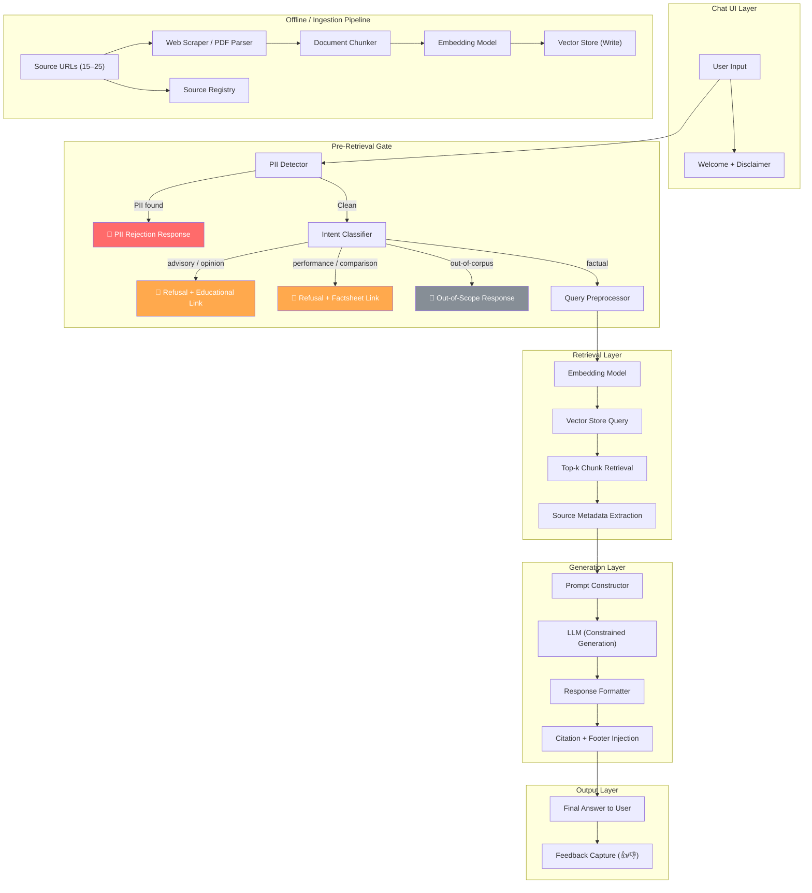
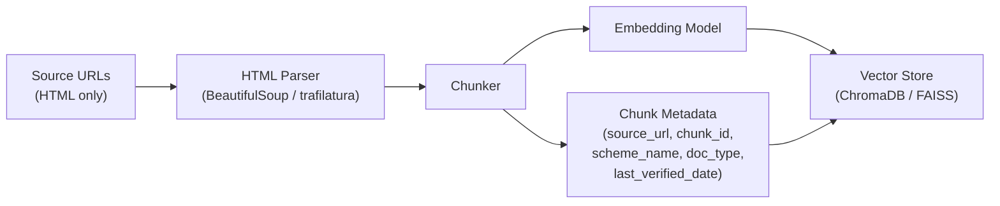
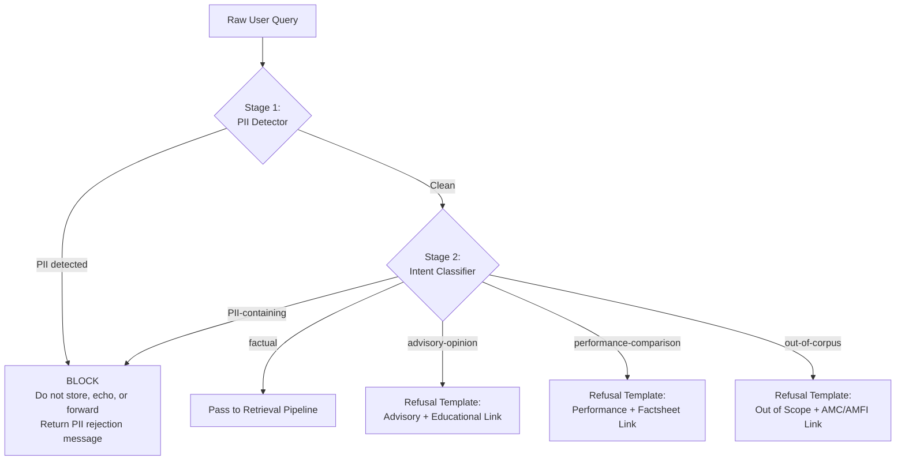
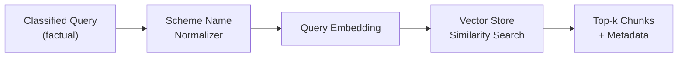
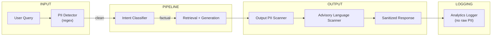
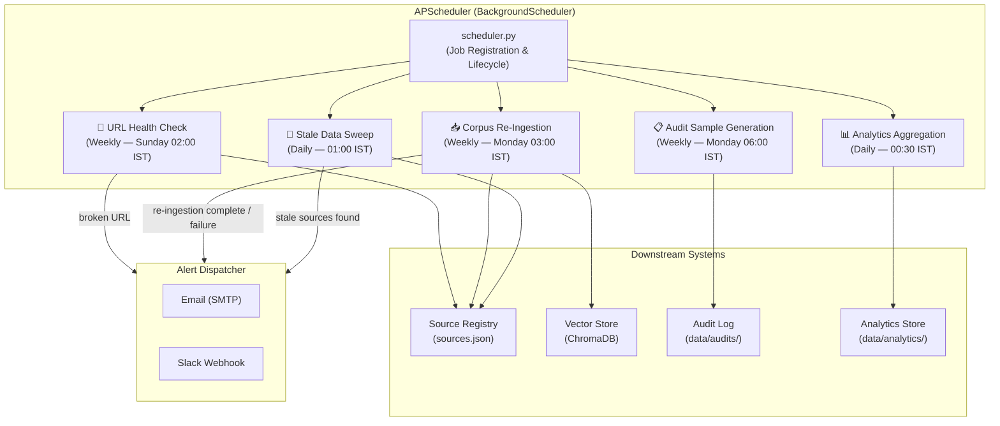
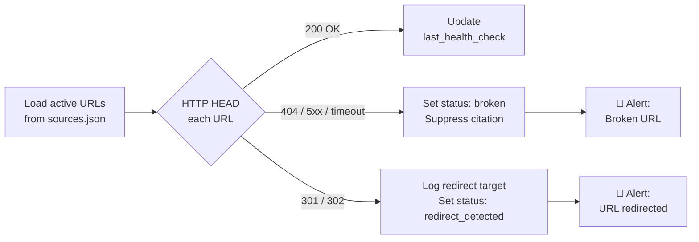
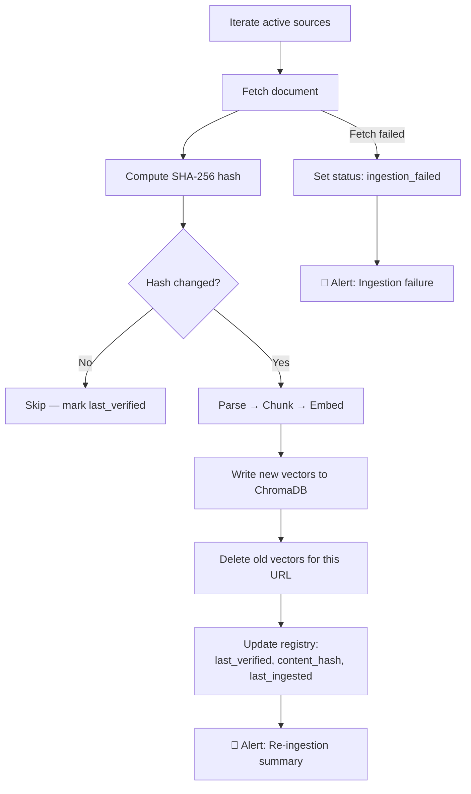
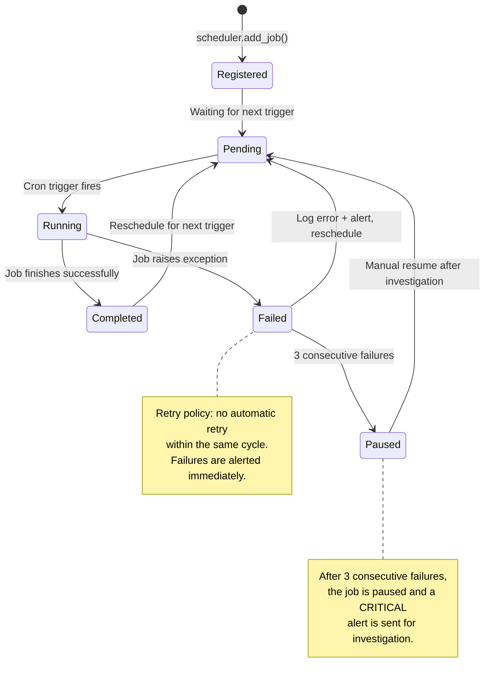
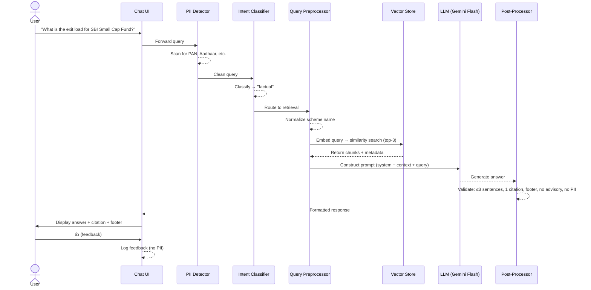

# RAG Architecture — Mutual Fund FAQ Assistant

**Product Context:** Groww · SBI Mutual Fund  
**Related Docs:** [`problemstatement.md`](file:///c:/Users/Prince Gupta/.antigravity-ide/Groww_Rag/problemstatement.md), [`PRD.md`](file:///c:/Users/Prince Gupta/.antigravity-ide/Groww_Rag/PRD.md)  
**Status:** Draft v1  
**Last Updated:** 2026-08-02

---

## 1. System Overview

The Mutual Fund FAQ Assistant is a **Retrieval-Augmented Generation (RAG)** system that answers factual queries about SBI Mutual Fund schemes by retrieving information from a curated corpus of official public sources (AMC, AMFI, SEBI) and generating short, citation-backed answers. It explicitly refuses advisory, opinion, or performance-comparison queries and rejects any input containing PII.

### 1.1 Design Principles

| Principle | Rationale |
|---|---|
| **Facts-only, never advisory** | Regulatory compliance — eliminates advisory drift risk |
| **Citation-first** | Every answer must be independently verifiable by the user |
| **Narrow scope, high accuracy** | Small corpus (15–25 URLs, 4 schemes) keeps retrieval precision high |
| **Fail safe** | When uncertain, refuse or ask for clarification rather than hallucinate |
| **No PII at any layer** | Personal data never enters the pipeline — blocked at the input gate |

### 1.2 High-Level Architecture Diagram



---

## 2. Component Architecture

### 2.1 Ingestion Pipeline (`src/ingestion/`)

The ingestion pipeline is an **offline, batch process** that transforms raw source documents into embedded, searchable vector chunks with full provenance metadata.

#### 2.1.1 Source Corpus

| Category | Sources | Count |
|---|---|---|
| Scheme pages (sbimf.com) | SBI Large Cap, Flexicap, ELSS Tax Saver, Small Cap | 4 |
| KIM / SID documents (PDFs) | Per-scheme KIM and SID documents | 4–6 |
| Factsheets (PDFs, monthly refresh) | Per-scheme factsheets from sbimf.com/factsheets | 4 |
| AMC FAQ / Help pages | FAQ, statement-download guides, grievance redressal, contact | 4–5 |
| AMFI / SEBI pages | Risk-o-meter, lock-in period, investor education | 3–4 |

**Total: 15–25 URLs** (see PRD §6.1 for the full verified list)

#### 2.1.2 Ingestion Steps



**Step-by-step:**

1. **Fetch** — Download each URL. HTML pages are fetched via `requests`/`httpx`.
2. **Parse** — Extract clean text using `trafilatura` or `BeautifulSoup` to strip navigation, footers, and boilerplate.
3. **Chunk** — Split into retrieval-sized chunks (see §2.1.3).
4. **Embed** — Generate vector embeddings for each chunk (see §2.1.4).
5. **Store** — Write embeddings + metadata to the vector store.

#### 2.1.3 Chunking Strategy

Financial webpages have structured data that must not be split mid-row. The chunking strategy is **semantic**:

| Document Type | Strategy | Chunk Size | Overlap |
|---|---|---|---|
| **HTML pages (scheme pages, FAQ)** | Semantic paragraph-based chunking; FAQ Q&A pairs kept as atomic chunks | 200–400 tokens | 50 tokens |
| **Regulatory pages (AMFI/SEBI)** | Paragraph-based with heading context prepended to each chunk | 200–400 tokens | 50 tokens |

**Metadata attached to every chunk:**

```json
{
  "chunk_id": "sbi-flexicap-scheme-page-chunk-1",
  "source_url": "https://www.sbimf.com/sbimf-scheme-details/sbi-flexicap-fund-39",
  "scheme_name": "SBI Flexicap Fund",
  "scheme_aliases": ["SBI Flexi Cap Fund"],
  "doc_type": "Scheme Page",
  "section_heading": "Exit Load",
  "last_verified_date": "2026-07-15"
}
```

#### 2.1.4 Embedding Model

| Option | Model | Dims | Notes |
|---|---|---|---|
| **Primary (recommended)** | `sentence-transformers/all-MiniLM-L6-v2` | 384 | Lightweight, fast, good general-purpose semantic similarity |
| **Alternative (higher accuracy)** | `BAAI/bge-small-en-v1.5` | 384 | Slightly better on financial text retrieval benchmarks |
| **Fallback (API-based)** | OpenAI `text-embedding-3-small` | 1536 | Higher quality but adds API dependency and cost |

The same embedding model **must** be used at both ingestion time and query time to ensure vector-space consistency.

#### 2.1.5 Vector Store

| Option | Type | Notes |
|---|---|---|
| **ChromaDB** (recommended for MVP) | Embedded, file-backed | Zero-infra, Python-native, metadata filtering, good for <50K chunks |
| **FAISS** | In-memory, file-persisted | Faster similarity search, but requires manual metadata management |
| **Pinecone / Weaviate** | Cloud-hosted | Overkill for MVP corpus size; consider for Phase 3+ multi-AMC scale |

**Recommended: ChromaDB** — it natively supports metadata filtering (filter by `scheme_name`, `doc_type`) and persists to disk without external infrastructure.

#### 2.1.6 Scheme Name Aliasing

The PRD notes that two schemes have been renamed:

| Current Official Name | Former Name (Synonym) |
|---|---|
| SBI Large Cap Fund | SBI Bluechip Fund |
| SBI ELSS Tax Saver Fund | SBI Long Term Equity Fund |

An **alias map** is maintained in the ingestion layer and the query preprocessor. When a user queries "SBI Bluechip Fund," it is normalized to "SBI Large Cap Fund" before retrieval, ensuring correct chunk matching and preventing hallucinated responses referencing outdated names.

---

### 2.2 Pre-Retrieval Gate (`src/safety/`)

Every user query passes through a **two-stage gate** before reaching the retrieval pipeline. This is the system's primary compliance firewall.



#### 2.2.1 PII Detector (Stage 1)

Runs **before** any other processing. Uses regex pattern matching to detect:

| PII Type | Pattern | Example |
|---|---|---|
| PAN | `[A-Z]{5}[0-9]{4}[A-Z]{1}` | ABCDE1234F |
| Aadhaar | `\b\d{4}\s?\d{4}\s?\d{4}\b` | 1234 5678 9012 |
| Account number | `\b\d{9,18}\b` (contextual) | 123456789012 |
| OTP | `\b\d{4,6}\b` preceded by OTP-related keywords | "my OTP is 4523" |
| Email | Standard email regex | user@example.com |
| Phone | `\b[+]?[0-9]{10,13}\b` | +919876543210 |

**Behavior on detection:**
- Immediately return a standardized rejection message
- Do **not** log, store, echo, or forward the raw query
- Only log a sanitized event: `{ "event": "pii_blocked", "pii_type": "PAN", "timestamp": "..." }`

#### 2.2.2 Intent Classifier (Stage 2)

Classifies the cleaned query into one of five intents:

| Intent | Examples | Routing |
|---|---|---|
| `factual` | "What is the expense ratio of SBI Small Cap Fund?" | → Retrieval pipeline |
| `advisory-opinion` | "Should I invest in SBI Flexicap?" / "Which fund is better?" | → Refusal + educational link |
| `performance-comparison` | "What were the 5-year returns?" / "Compare returns of X vs Y" | → Refusal + factsheet link |
| `pii-containing` | "My PAN is ABCDE1234F, check my folio" | → PII rejection (redundant safety net) |
| `out-of-corpus` | "Tell me about HDFC Midcap Fund" | → Out-of-scope response |

**Implementation approach:**

| Approach | Pros | Cons |
|---|---|---|
| **Keyword + rule-based classifier** (recommended for MVP) | Transparent, debuggable, no model dependency, fast | May miss edge-case reframings |
| **Zero-shot LLM classification** | Handles nuanced phrasing, adversarial reframing | Adds latency and cost; less deterministic |
| **Fine-tuned small classifier** (Phase 2+) | Best accuracy/latency trade-off at scale | Requires labeled training data |

**MVP recommendation:** Start with a **keyword/rule-based classifier** augmented by a small set of regex patterns for advisory keywords ("should I", "which is better", "recommend", "suggest", "hypothetically", "if you were an advisor"). Upgrade to a lightweight classifier in Phase 2 after collecting labeled query data from the beta.

**Adversarial edge case:** The classifier must treat reframed advisory intent the same as direct advisory intent (e.g., "hypothetically, if you were an advisor…" → `advisory-opinion`).

#### 2.2.3 Refusal & Redirection Templates

Three distinct refusal templates, each with a consistent tone:

**Advisory/Opinion Refusal:**
> "I can only provide factual information about mutual fund schemes. I'm not able to offer investment advice, recommendations, or opinions. For guidance on investing, you may find AMFI's investor education resources helpful: [mutualfundssahihai.com](https://www.mutualfundssahihai.com)"

**Performance/Comparison Refusal:**
> "I don't compute or compare returns. For the latest performance data, please refer to the official factsheet: [SBI Mutual Fund Factsheets](https://www.sbimf.com/factsheets)"

**PII Rejection:**
> "For your security, I cannot process messages containing personal information such as PAN, Aadhaar, account numbers, or contact details. Please remove any personal data and rephrase your question."

**Out-of-Scope:**
> "This scheme/AMC isn't in my current coverage. You can look it up directly on the AMC's website or at [amfiindia.com](https://www.amfiindia.com)."

---

### 2.3 Retrieval Pipeline (`src/retrieval/`)

The retrieval layer takes a classified `factual` query and returns the most relevant document chunks with full source metadata.

#### 2.3.1 Query Preprocessing



1. **Scheme Name Normalization** — Map aliases to canonical names using the alias map (§2.1.6). Also handle common abbreviations ("flexicap" → "SBI Flexicap Fund").
2. **Disambiguation** — If the query references a scheme ambiguously (e.g., "the small cap fund" without naming SBI), and multiple matches exist, return a clarifying question listing in-scope schemes instead of guessing.
3. **Query Embedding** — Embed the normalized query using the same model as ingestion.

#### 2.3.2 Vector Similarity Search

| Parameter | Value | Rationale |
|---|---|---|
| **Top-k** | 3–5 | Small corpus; 3 chunks usually sufficient. 5 as upper bound to handle table-heavy factsheets |
| **Distance metric** | Cosine similarity | Standard for sentence-transformer embeddings |
| **Metadata filter** | Optional: filter by `scheme_name` when the query clearly references a specific scheme | Reduces noise; improves precision |
| **Similarity threshold** | ≥ 0.65 (configurable) | Below this, the system should respond with "unable to confirm from current sources" |

#### 2.3.3 Source Conflict Resolution

When multiple retrieved chunks contain conflicting data (e.g., an outdated factsheet vs. a newer one):

1. **Prefer the chunk with the most recent `last_verified_date`**
2. **If dates are unclear or identical**, respond with: "Unable to confirm from current sources — please refer to [official source link]"
3. **Never silently pick one** conflicting answer over another

#### 2.3.4 No-Match Handling

If no chunk exceeds the similarity threshold:

- Respond with an out-of-scope message
- Provide a link to the relevant AMC or AMFI page
- Log the query for corpus-gap analysis

---

### 2.4 Generation Layer (`src/generation/`)

The generation layer takes retrieved chunks and produces a constrained, citation-backed natural-language answer.

#### 2.4.1 Prompt Template

```
SYSTEM:
You are a facts-only mutual fund FAQ assistant for SBI Mutual Fund schemes.
You MUST follow these rules strictly:

1. Answer ONLY using the information in the CONTEXT below. Do not use any
   external knowledge.
2. Your answer MUST be 3 sentences or fewer.
3. You MUST include exactly ONE citation link from the source metadata.
4. You MUST end with: "Last updated from sources: <date>"
5. If the context does not contain enough information to answer, say:
   "I couldn't find this information in my current sources."
   and provide the most relevant source link for manual lookup.
6. NEVER provide investment advice, opinions, or recommendations.
7. NEVER compute, estimate, or compare returns or performance figures.
8. NEVER echo or reference any personal information.

CONTEXT:
{retrieved_chunks_with_source_metadata}

USER QUERY:
{user_query}

ANSWER:
```

#### 2.4.2 LLM Selection

| Option | Model | Notes |
|---|---|---|
| **Primary (recommended)** | Google Gemini 1.5 Flash | Fast, cost-effective, good instruction-following for constrained generation |
| **Alternative** | OpenAI GPT-4o-mini | Strong instruction adherence, slightly higher cost |
| **Local/offline** | Ollama + Mistral 7B / Llama 3 8B | No API dependency; requires local GPU; quality trade-off |

**Recommended for MVP:** Gemini 1.5 Flash — balances latency (<2s generation), cost, and instruction-following quality.

#### 2.4.3 Output Constraints (Enforced Post-Generation)

Even with prompt-level constraints, a **post-processing validator** must enforce:

| Constraint | Enforcement |
|---|---|
| ≤ 3 sentences | Count sentence-ending punctuation; truncate if exceeded |
| Exactly 1 citation link | Verify presence of a URL from the source metadata; inject if missing |
| "Last updated" footer | Append if missing: `Last updated from sources: {max(last_verified_date)}` |
| No advisory language | Scan for advisory keywords in output; if found, replace with refusal template |
| No PII echo | Re-run PII detector on the output as a safety net |

#### 2.4.4 Response Format

```
{answer_text}

📎 Source: {citation_url}
🕐 Last updated from sources: {date}
```

**Example:**

> The expense ratio for SBI Small Cap Fund (Regular Plan) is 1.58% as of the latest factsheet. This includes the base TER and additional expenses as permitted by SEBI.
>
> 📎 Source: https://www.sbimf.com/factsheets  
> 🕐 Last updated from sources: 2026-07-15

---

### 2.5 Chat UI Layer

A minimal, trust-first chat interface.

#### 2.5.1 UI Components

| Component | Details |
|---|---|
| **Welcome message** | Greet + explain the assistant's scope (facts-only, SBI MF schemes) |
| **Example questions** (3) | Pre-populated clickable chips: "What is the expense ratio of SBI Flexicap Fund?", "What is the exit load for SBI Small Cap Fund?", "How do I download my capital gains statement?" |
| **Persistent disclaimer** | Visible at all times: *"Facts-only. No investment advice."* |
| **Chat input** | Single-line text input with send button |
| **Answer display** | Formatted answer with clickable citation link and footer |
| **Feedback widget** | 👍/👎 buttons on each answer (no PII attached) |

#### 2.5.2 Technology

| Option | Notes |
|---|---|
| **Streamlit** (recommended for MVP) | Fastest to prototype; built-in chat UI components; Python-native |
| **Gradio** | Alternative to Streamlit; good for ML demos |
| **React + Vite** | For production-quality UI in Phase 2+ |

---

### 2.6 Safety & Privacy Layer (`src/safety/`)

This cross-cutting layer enforces privacy and compliance at every boundary.



#### 2.6.1 Guardrails Summary

| Guardrail | Where | How |
|---|---|---|
| PII detection | Input gate + output post-processing | Regex patterns for PAN, Aadhaar, account, OTP, email, phone |
| Advisory refusal | Intent classifier + output scanner | Keyword/rule-based classification + output keyword scan |
| Performance refusal | Intent classifier | Keyword detection for return/comparison queries |
| No PII logging | Logging layer | Raw queries with detected PII are never persisted |
| Citation integrity | Output post-processing | Verify citation URL exists in source registry; suppress broken links |

---

### 2.7 Feedback & Analytics (`src/feedback/`)

#### 2.7.1 Per-Answer Feedback

- 👍/👎 buttons on every response
- Stored with: `{ query_hash, intent, answer_hash, feedback, timestamp }`
- **No raw query text or PII** in feedback logs

#### 2.7.2 Analytics Events

| Event | Fields Logged |
|---|---|
| `query_received` | intent classification, scheme_name (if detected), timestamp |
| `pii_blocked` | pii_type, timestamp |
| `refusal_served` | refusal_type (advisory/performance/out-of-scope), timestamp |
| `answer_served` | scheme_name, doc_type_used, citation_url, retrieval_score, latency_ms |
| `feedback_received` | answer_hash, thumbs_up/down, timestamp |

#### 2.7.3 Weekly Audit Workflow

1. Sample 20–30 answered queries per week
2. Human reviewer checks: (a) factual correctness, (b) citation links to the right source, (c) no advisory content leaked
3. Log results in audit trail; flag failures for retrieval/prompt tuning

---

### 2.8 Corpus Freshness & Source Registry (`src/data/`)

#### 2.8.1 Source Registry Schema

```json
{
  "sources": [
    {
      "url": "https://www.sbimf.com/factsheets",
      "doc_type": "factsheet_index",
      "schemes": ["all"],
      "last_verified": "2026-07-15",
      "refresh_frequency": "monthly",
      "status": "active"
    },
    {
      "url": "https://www.sbimf.com/docs/default-source/sif-forms/sid---sbi-flexicap-fund.pdf",
      "doc_type": "SID",
      "schemes": ["SBI Flexicap Fund"],
      "last_verified": "2026-07-10",
      "refresh_frequency": "as_needed",
      "status": "active"
    }
  ]
}
```

#### 2.8.2 Freshness Monitoring

| Check | Frequency | Action on Failure |
|---|---|---|
| HTTP HEAD on each URL (check for 404/redirect) | Weekly | Flag in source registry; suppress citation until fixed |
| Content hash comparison (detect material changes) | Weekly | Trigger re-ingestion of changed documents |

---

### 2.9 Scheduler & Background Jobs (`src/scheduler/`)

The system requires several recurring background tasks to keep the corpus fresh, monitor source health, and maintain audit quality. These are **not** user-facing — they run autonomously on a defined cadence and surface results through alerts and the source registry.

#### 2.9.1 Scheduler Architecture Overview



#### 2.9.2 Scheduler Engine

| Decision | Choice | Rationale |
|---|---|---|
| **Library** | [APScheduler](https://apscheduler.readthedocs.io/) (`BackgroundScheduler`) | Mature Python-native scheduler; supports cron triggers, interval triggers, missed-job coalescing, and persistent job stores — all without external infrastructure |
| **Job Store** | SQLite-backed (`SQLAlchemyJobStore`) | Persists job state across process restarts; no separate database needed |
| **Executor** | `ThreadPoolExecutor` (max 3 workers) | Jobs are I/O-bound (HTTP calls, file reads); thread pool avoids blocking the main application process |
| **Missed Job Policy** | `misfire_grace_time=3600`, `coalesce=True` | If the process was down when a job was due, run it once on restart (within 1-hour grace) instead of stacking multiple missed runs |

**Startup:** The scheduler is initialized in `src/scheduler/scheduler.py` and started as a daemon alongside the main Streamlit app process. On app shutdown, `scheduler.shutdown(wait=True)` ensures any in-flight job completes gracefully.

```python
# src/scheduler/scheduler.py — initialization sketch
from apscheduler.schedulers.background import BackgroundScheduler
from apscheduler.jobstores.sqlalchemy import SQLAlchemyJobStore
from apscheduler.executors.pool import ThreadPoolExecutor

jobstores = {
    "default": SQLAlchemyJobStore(url="sqlite:///data/scheduler_jobs.db")
}
executors = {
    "default": ThreadPoolExecutor(max_workers=3)
}
job_defaults = {
    "coalesce": True,
    "max_instances": 1,
    "misfire_grace_time": 3600
}

scheduler = BackgroundScheduler(
    jobstores=jobstores,
    executors=executors,
    job_defaults=job_defaults
)
```

#### 2.9.3 Scheduled Jobs

##### Job 1 — URL Health Check (`jobs/url_health_check.py`)

**Purpose:** Detect broken or redirected source URLs before a user hits a dead citation link (PRD §6.5 — "alerting when a source URL 404s or content structure changes materially").

| Attribute | Value |
|---|---|
| **Schedule** | Weekly — every Sunday at 02:00 IST |
| **Trigger** | `CronTrigger(day_of_week='sun', hour=2, minute=0)` |
| **Input** | All URLs in `sources.json` with `status: "active"` |
| **Process** | Send HTTP HEAD request to each URL; check status code and final redirect URL |
| **On success (200)** | Update `last_health_check` timestamp in registry |
| **On failure (404/5xx/timeout)** | Set `status: "broken"` in registry → suppresses citation in answers; send alert |
| **On redirect (301/302)** | Log new URL; set `status: "redirect_detected"` ; send alert for manual review |



---

##### Job 2 — Corpus Re-Ingestion (`jobs/corpus_reingestion.py`)

**Purpose:** Keep the vector store current by detecting content changes in source documents and re-ingesting updated material (PRD §6.5 — "lightweight re-crawl/refresh job to catch factsheet updates; factsheets are typically refreshed monthly").

| Attribute | Value |
|---|---|
| **Schedule** | Weekly — every Monday at 03:00 IST |
| **Trigger** | `CronTrigger(day_of_week='mon', hour=3, minute=0)` |
| **Input** | All URLs with `status: "active"` or `status: "redirect_detected"` (using new URL) |
| **Process** | 1. Re-fetch document (HTML or PDF). 2. Compute content hash (SHA-256). 3. Compare with stored hash. 4. If changed: re-parse → re-chunk → re-embed → replace old vectors in ChromaDB. 5. Update `last_verified`, `content_hash`, and `last_ingested` in registry. |
| **Scope guard** | Only re-ingests documents whose hash has actually changed — avoids unnecessary vector churn |
| **On completion** | Send summary alert: `{ changed: N, unchanged: M, failed: K }` |
| **On failure** | Mark source as `status: "ingestion_failed"` ; alert with error details; retain old vectors (do not delete stale data until new data is confirmed) |

**Re-ingestion is atomic per source:** old chunks for a URL are only deleted from the vector store *after* new chunks are successfully written, preventing a window where a source has zero coverage.



---

##### Job 3 — Audit Sample Generation (`jobs/audit_sample_gen.py`)

**Purpose:** Automatically extract a weekly random sample of answered queries for human accuracy review (PRD §6.7 — "Weekly accuracy sampling workflow for human audit of citation correctness").

| Attribute | Value |
|---|---|
| **Schedule** | Weekly — every Monday at 06:00 IST |
| **Trigger** | `CronTrigger(day_of_week='mon', hour=6, minute=0)` |
| **Input** | All `answer_served` events from the past 7 days |
| **Process** | 1. Load events from analytics store. 2. Stratified random sample: 20–30 queries, balanced across schemes and doc types. 3. For each sample: record `query_hash`, `answer_hash`, `citation_url`, `scheme_name`, `retrieval_score`. 4. Write to `data/audits/audit_YYYY-WNN.json`. |
| **Output** | Audit file + Slack/email notification to the review team with sample count and link to the audit file |
| **Human workflow** | Reviewer opens the audit file, checks each entry for: (a) factual correctness, (b) citation accuracy, (c) no advisory leakage. Results logged back into the audit file. |

**Audit sample schema:**

```json
{
  "audit_id": "2026-W31",
  "generated_at": "2026-08-04T06:00:00+05:30",
  "sample_size": 25,
  "entries": [
    {
      "query_hash": "a1b2c3...",
      "answer_hash": "d4e5f6...",
      "scheme_name": "SBI Small Cap Fund",
      "citation_url": "https://www.sbimf.com/factsheets",
      "retrieval_score": 0.87,
      "doc_type": "factsheet",
      "review_status": "pending",
      "factual_correct": null,
      "citation_correct": null,
      "advisory_leak": null,
      "reviewer_notes": null
    }
  ]
}
```

---

##### Job 4 — Stale Data Sweep (`jobs/stale_data_sweep.py`)

**Purpose:** Proactively flag sources that haven't been verified beyond their expected refresh cadence, ensuring the "Last updated from sources: `<date>`" footer remains trustworthy.

| Attribute | Value |
|---|---|
| **Schedule** | Daily — 01:00 IST |
| **Trigger** | `CronTrigger(hour=1, minute=0)` |
| **Input** | All entries in `sources.json` |
| **Process** | For each source, compute `days_since_last_verified = today - last_verified`. Compare against staleness thresholds by `refresh_frequency`. |
| **Staleness thresholds** | `monthly` → stale after 45 days · `as_needed` → stale after 90 days |
| **On stale detection** | Set `status: "stale"` in registry; send alert listing all stale sources |
| **Effect on answers** | Stale sources are not suppressed (unlike broken URLs) but the `Last updated` footer will naturally show an older date, signaling reduced confidence to the user |

---

##### Job 5 — Analytics Aggregation (`jobs/analytics_aggregate.py`)

**Purpose:** Compile daily raw analytics events into summary reports for operational visibility (PRD §6.7 — "Query-category tagging for support-team visibility into what's being deflected").

| Attribute | Value |
|---|---|
| **Schedule** | Daily — 00:30 IST |
| **Trigger** | `CronTrigger(hour=0, minute=30)` |
| **Input** | Raw analytics events from the past 24 hours |
| **Output** | Daily summary written to `data/analytics/daily_YYYY-MM-DD.json` |

**Aggregated metrics:**

| Metric | Aggregation |
|---|---|
| Total queries | Count |
| Queries by intent (`factual`, `advisory-opinion`, `performance-comparison`, `pii-containing`, `out-of-corpus`) | Count per category |
| Queries by scheme | Count per scheme |
| PII blocks | Count by PII type |
| Refusals served | Count by refusal type |
| Average retrieval score | Mean of top-1 retrieval similarity |
| Median response latency | p50 of end-to-end latency |
| Feedback distribution | Count of 👍 vs 👎 |

---

#### 2.9.4 Alert Dispatcher (`alerts.py`)

All scheduled jobs route their notifications through a centralized alert dispatcher that supports two channels:

| Channel | Use Case | Configuration |
|---|---|---|
| **Email (SMTP)** | Critical alerts (broken URLs, ingestion failures) — reaches on-call regardless of Slack availability | SMTP host, port, credentials, recipient list in `config.yaml` |
| **Slack Incoming Webhook** | Operational alerts (re-ingestion summary, audit sample ready, staleness warnings) — low-noise ops channel | Webhook URL in `config.yaml` |

**Alert severity levels:**

| Level | Routing | Examples |
|---|---|---|
| 🔴 `CRITICAL` | Email + Slack | Broken source URL, ingestion failure, PII breach in output |
| 🟡 `WARNING` | Slack only | Stale source detected, URL redirect detected, low retrieval scores |
| 🟢 `INFO` | Slack only (optional) | Re-ingestion completed successfully, audit sample generated, daily analytics summary |

**Alert payload schema:**

```json
{
  "severity": "CRITICAL",
  "job": "url_health_check",
  "timestamp": "2026-08-03T02:15:00+05:30",
  "summary": "2 source URLs returned 404",
  "details": [
    {
      "url": "https://www.sbimf.com/docs/default-source/...",
      "status_code": 404,
      "action_taken": "Citation suppressed, status set to 'broken'"
    }
  ]
}
```

#### 2.9.5 Scheduler Job Lifecycle



#### 2.9.6 Failure Handling & Resilience

| Scenario | Behavior |
|---|---|
| **App process restarts** | SQLite jobstore persists job schedule; `misfire_grace_time=3600` runs missed jobs within 1 hour of restart |
| **Job exceeds timeout** | Each job has a `max_execution_time` (default 30 min); exceeded → kill thread, log failure, alert |
| **Network failure during fetch** | Per-URL retry with exponential backoff (3 attempts, 5s/15s/45s); after 3 failures, mark source as `fetch_failed` and alert |
| **Vector store write failure** | Atomic re-ingestion — old vectors retained until new vectors confirmed; job marked as failed, CRITICAL alert |
| **3 consecutive failures for any job** | Job auto-paused; CRITICAL alert sent; requires manual `scheduler.resume_job()` after investigation |

#### 2.9.7 Scheduler Configuration

All job schedules, thresholds, and alert routing are externalized in `config.yaml` to allow tuning without code changes:

```yaml
scheduler:
  timezone: "Asia/Kolkata"
  jobstore_url: "sqlite:///data/scheduler_jobs.db"
  max_workers: 3
  misfire_grace_time: 3600

jobs:
  url_health_check:
    enabled: true
    cron: "0 2 * * 0"          # Sunday 02:00
    timeout_minutes: 30
    alert_on_failure: true

  corpus_reingestion:
    enabled: true
    cron: "0 3 * * 1"          # Monday 03:00
    timeout_minutes: 120
    alert_on_completion: true
    alert_on_failure: true

  audit_sample_generation:
    enabled: true
    cron: "0 6 * * 1"          # Monday 06:00
    sample_size: 25
    min_sample_size: 10        # Skip if fewer queries than this
    alert_on_completion: true

  stale_data_sweep:
    enabled: true
    cron: "0 1 * * *"          # Daily 01:00
    staleness_thresholds:
      monthly: 45              # days
      as_needed: 90            # days
    alert_on_stale: true

  analytics_aggregation:
    enabled: true
    cron: "30 0 * * *"         # Daily 00:30
    alert_on_completion: false

alerts:
  email:
    enabled: true
    smtp_host: "smtp.gmail.com"
    smtp_port: 587
    sender: "mf-faq-bot@groww.in"
    recipients:
      - "ops-team@groww.in"
    severity_filter: ["CRITICAL"]

  slack:
    enabled: true
    webhook_url: "${SLACK_WEBHOOK_URL}"
    channel: "#mf-faq-ops"
    severity_filter: ["CRITICAL", "WARNING", "INFO"]
```

---

## 3. Data Flow — End-to-End Request Lifecycle



---

## 4. Directory Structure

```
Groww_Rag/
├── data/
│   ├── sources.json              # Source registry (URLs, metadata, timestamps)
│   ├── raw/                      # Downloaded PDFs and HTML snapshots
│   ├── processed/                # Parsed, cleaned text files
│   └── vectorstore/              # ChromaDB persistent storage
│
├── src/
│   ├── ingestion/
│   │   ├── fetcher.py            # Download URLs (HTML + PDF)
│   │   ├── parser.py             # HTML/PDF → clean text
│   │   ├── chunker.py            # Hybrid chunking (table-aware + semantic)
│   │   ├── embedder.py           # Generate embeddings
│   │   └── ingest_pipeline.py    # Orchestrate full ingestion
│   │
│   ├── safety/
│   │   ├── pii_detector.py       # Regex-based PII pattern matching
│   │   ├── intent_classifier.py  # Rule-based query intent classification
│   │   ├── refusal_templates.py  # Standardized refusal responses
│   │   └── output_validator.py   # Post-generation safety checks
│   │
│   ├── retrieval/
│   │   ├── query_preprocessor.py # Scheme normalization, alias mapping
│   │   ├── retriever.py          # Vector search + metadata extraction
│   │   └── conflict_resolver.py  # Handle conflicting/outdated sources
│   │
│   ├── generation/
│   │   ├── prompt_template.py    # System + context + query prompt builder
│   │   ├── generator.py          # LLM API call (Gemini Flash)
│   │   └── response_formatter.py # Enforce output constraints, inject citation
│   │
│   ├── feedback/
│   │   ├── feedback_store.py     # Store thumbs up/down (no PII)
│   │   └── analytics.py          # Event logging and query categorization
│   │
│   ├── scheduler/
│   │   ├── scheduler.py          # APScheduler setup and job registration
│   │   ├── jobs/
│   │   │   ├── url_health_check.py    # Weekly URL 404/redirect check
│   │   │   ├── corpus_reingestion.py  # Monthly content-hash re-ingestion
│   │   │   ├── audit_sample_gen.py    # Weekly audit sample extraction
│   │   │   ├── stale_data_sweep.py    # Daily staleness threshold check
│   │   │   └── analytics_aggregate.py # Daily event log aggregation
│   │   └── alerts.py             # Email/Slack notification dispatcher
│   │
│   └── data/
│       ├── source_registry.py    # CRUD for sources.json
│       ├── freshness_checker.py  # HTTP HEAD + content hash checks
│       └── alias_map.py          # Scheme name alias configuration
│
├── app.py                        # Streamlit chat UI entry point
├── requirements.txt              # Python dependencies
├── problemstatement.md
├── PRD.md
├── rag-architecture.md           # This document
└── README.md
```

---

## 5. Technology Stack Summary

| Layer | Technology | Rationale |
|---|---|---|
| **Language** | Python 3.11+ | Ecosystem maturity for ML/NLP/RAG tooling |
| **PDF Parsing** | pdfplumber + PyMuPDF | Table-aware extraction for factsheets |
| **HTML Parsing** | trafilatura / BeautifulSoup | Clean text extraction from web pages |
| **Chunking** | LangChain text splitters (customized) | Configurable, supports metadata passthrough |
| **Embeddings** | sentence-transformers (`all-MiniLM-L6-v2`) | Fast, lightweight, no API dependency |
| **Vector Store** | ChromaDB (persistent mode) | Zero-infra, metadata filtering, Python-native |
| **LLM** | Google Gemini 1.5 Flash (API) | Fast, cost-effective, strong instruction-following |
| **UI** | Streamlit | Rapid prototyping with built-in chat components |
| **PII Detection** | Custom regex module | Deterministic, no model dependency, auditable |
| **Scheduler** | APScheduler (BackgroundScheduler + SQLite jobstore) | In-process, cron-style scheduling, job persistence, missed-job coalescing, zero external infra |
| **Alerting** | SMTP (email) + Slack Incoming Webhooks | Lightweight, no third-party SaaS dependency for MVP |

---

## 6. Key Design Decisions

### 6.1 Why RAG over Fine-Tuning?

| Factor | RAG | Fine-Tuning |
|---|---|---|
| **Data freshness** | Updates by re-ingesting new documents — no retraining | Stale until retrained on new data |
| **Citation traceability** | Source URL attached to every retrieved chunk | No built-in citation mechanism |
| **Corpus size** | Ideal for small, well-bounded corpora (15–25 docs) | Requires large training sets for good generalization |
| **Transparency** | User can click citation to verify | Black-box answers |
| **Cost** | Embedding once + API calls per query | GPU-hours for training + hosting |

**Verdict:** RAG is the clear fit for a facts-only system with a small, curated corpus where every answer must be traceable to a source document.

### 6.2 Why Pre-Retrieval Gating (Not Post-Generation Filtering)?

Blocking non-factual queries **before** they hit the retrieval pipeline:
- **Saves compute** — no embedding/search/LLM call for advisory queries
- **Eliminates risk** — the LLM never even sees an advisory query, so it can't accidentally produce advice
- **Faster refusals** — refusal responses are served in <100ms (template, no model call)

Post-generation filtering is still applied as a **defense-in-depth** layer, but the pre-retrieval gate is the primary firewall.

### 6.3 Why ≤3 Sentences + 1 Citation?

- **Constraint reduces hallucination surface** — shorter answers leave less room for the LLM to interpolate
- **Single citation is verifiable** — multiple citations diffuse accountability; one link per answer means the user can verify in one click
- **Matches the query pattern** — the target queries (expense ratio, exit load, lock-in) all have single, short answers

---

## 7. Edge Case Handling Matrix

| Edge Case | Detection | Response |
|---|---|---|
| Mixed factual + advisory query | Intent classifier detects advisory keywords in query | Answer factual part only; append refusal for advisory part |
| Ambiguous scheme reference | Scheme normalizer finds multiple matches or no match | Ask a single disambiguating question listing in-scope schemes |
| Conflicting source data | Retriever returns chunks with different facts for the same field | Use most recent `last_verified_date`; if tied, return "unable to confirm" |
| No relevant chunk found | All retrieval scores below similarity threshold (0.65) | Out-of-scope response + relevant AMC/AMFI link |
| User submits PII | PII detector regex match | Immediate rejection; no storage, no echo |
| Broken source URL | Freshness checker detects 404 | Suppress citation; fall back to "unable to confirm" until registry updated |
| Adversarial prompt injection | Intent classifier patterns for reframed advisory intent | Treated identically to direct advisory intent |
| Non-English / Hinglish query | Low intent-classification confidence | Ask for clarification in English |
| Very short query (e.g., "SIP?") | Query preprocessor detects missing scheme context | Prompt for specific scheme name |
| Repeated identical query | Deterministic retrieval + generation | Same query → same answer (consistency guarantee) |

---

## 8. Performance & Latency Budget

| Stage | Target Latency | Notes |
|---|---|---|
| PII Detection | < 10 ms | Regex — near-instant |
| Intent Classification | < 50 ms | Rule-based — near-instant |
| Query Preprocessing | < 20 ms | Alias lookup + normalization |
| Embedding (query) | < 100 ms | Local sentence-transformer model |
| Vector Search | < 100 ms | ChromaDB with <50K vectors |
| LLM Generation | < 2,000 ms | Gemini Flash API (target p95) |
| Post-Processing | < 50 ms | Regex + string validation |
| **Total E2E** | **< 2,500 ms** | **Well under the 3-second PRD target** |

---

## 9. Security & Compliance Summary

| Requirement | Implementation |
|---|---|
| No PII collection/storage | PII detector at input gate + output scanner; no raw PII in any log |
| No investment advice | Intent classifier + output advisory scanner; refusal templates |
| No performance computation | Intent classifier blocks return/comparison queries |
| Source-backed answers only | LLM prompt constrains to context; post-processor validates citation |
| Transparency | Every answer has a clickable citation + last-updated date |
| Data sources | Official only: sbimf.com, amfiindia.com, SEBI — no third-party blogs |

---

## 10. Phase Alignment

| Phase | Architecture Focus |
|---|---|
| **Phase 0 — Foundations** | Ingestion pipeline, source registry, vector store setup, embedding pipeline |
| **Phase 1 — MVP** | Pre-retrieval gate, retrieval pipeline, constrained generation, Streamlit UI, core 7 fact categories |
| **Phase 2 — Hardening** | Upgrade intent classifier (keyword → lightweight model), feedback loop, edge-case refinements, weekly audit workflow |
| **Phase 3 — Scale** | Automated freshness monitoring, additional schemes/AMCs, latency optimization, production UI (React) |
| **Phase 4 — Broader Rollout** | Multi-AMC corpus, in-app integration, deeper analytics |
